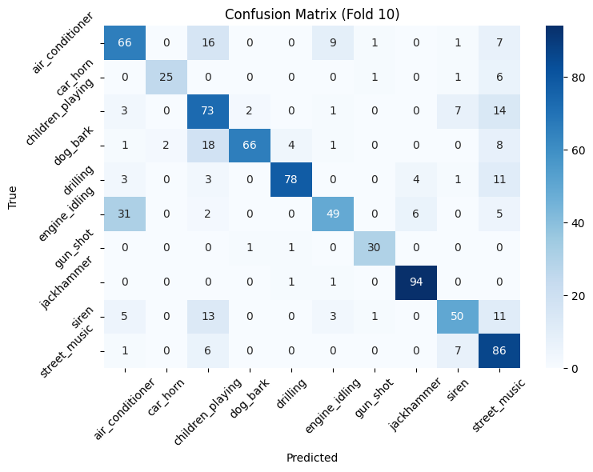

# 🎧 UrbanSound8K Audio Classification with CNN

This project classifies **urban sounds** (e.g., dog barks, sirens, jackhammers) using **Convolutional Neural Networks (CNNs)** on the [UrbanSound8K dataset](https://urbansounddataset.weebly.com/urbansound8k.html).

---

## 🧠 Project Overview
Urban sound classification is an important task in environmental monitoring and smart cities.  
The goal of this project is to automatically recognize **10 types of sounds** from short audio clips.

---

## ⚙️ Tech Stack
- Python 3.x  
- TensorFlow / Keras  
- Librosa (audio feature extraction)  
- NumPy, Pandas, Matplotlib, Seaborn  
- Scikit-learn (evaluation metrics)

---

## 📂 Project Structure

UrbanSound-Classification/
├── notebook/
│   └── urbansound_classification.ipynb
├── models/
│   └── urbansound8k_keras_cnn.h5
├── results/
│   ├── confusion_matrix.png
│   ├── training_curves.png
│   ├── roc_curves.png
│   └── precision_recall_curves.png
├── Dataset/
│   └── UrbanSound8K.csv
├── requirements.txt
└── README.md


---

## 🧩 Model Architecture
The CNN consists of:
- 4 convolutional blocks with BatchNorm + MaxPooling
- 2 fully connected dense layers with dropout
- Output layer with 10 softmax neurons

---

## 📈 Results

| Metric | Accuracy |
|--------|-----------|
| Training | 90.62% |
| Validation | 79.66% |
| Test | **73.72%** |

Confusion matrix example:



---

## 🔍 Insights
- The model performs best on distinct sounds (e.g., *gun_shot*, *jackhammer*).  
- Sounds with overlapping frequency patterns (e.g., *engine_idling* vs *air_conditioner*) are harder to distinguish.  
- Further improvement could be achieved with **data augmentation** or **transfer learning**.

---

## 💾 How to Run

```bash
# 1. Clone the repo
git clone https://github.com/<FloricaDolca>/UrbanSound-Classification.git
cd UrbanSound-Classification

# 2. Install dependencies
pip install -r requirements.txt

# 3. Open notebook
jupyter notebook notebook/urbansound_classification.ipynb

